# bellabeat-data-analysis-case-study

## Introduction

Welcome to my capstone project for the Google Data Analytics Certificate course.

Bellabeat, a high-tech manufacturer of health-focused products for women, is a successful small company with the potential to become a larger player in the global smart device market. Urška Sršen, co-founder and Chief Creative Officer of Bellabeat believes that analyzing smart device fitness data could unlock new growth opportunities for the company.

As a junior data analyst, I focus on one of Bellabeat’s products and analyze smart device data to gain insights into how consumers use their smart devices. These insights will then help guide the company’s marketing strategy. I will present my analysis to the Bellabeat executive team and make high-level recommendations for their marketing strategy.

## Ask

Sršen asks you to analyze smart device usage data to gain insight into how consumers use non-Bellabeat smart devices. She then wants you to select one Bellabeat product to apply these insights to in your presentation. 

These questions will guide your analysis:
1. What are some trends in smart device usage?
2. How could these trends apply to Bellabeat customers?
3. How could these trends help influence Bellabeat's marketing strategy?

Stakeholders:
- Urška Sršen - Bellabeat co-founder and Chief Creative Officer
- Sando Mur - Bellabeat cofounder and a key member of the Bellabeat executive team
- Bellabeat Marketing Analytics team

## Prepare

The dataset used for this case study is [FitBit Fitness Tracker Data](https://www.kaggle.com/datasets/arashnic/fitbit) The dataset is stored in Kaggle and made available through [Mobius](https://www.kaggle.com/arashnic) This Kaggle data set contains personal fitness tracker from thirty Fitbit users. Thirty eligible Fitbit users consented to the submission of personal tracker data, including minute-level output for physical activity, heart rate, and sleep monitoring. It includes information about daily activity, steps, and heart rate that can be used to explore users’ habits.

- The Fitbit Fitness Tracker data was collected in 2016, making it outdated for current trend analysis.
- The data was collected over only 31 days (April 12, 2016, to May 12, 2016).
- The data source includes information from only 33 Fitbit tracker users, which is a small sample size and less representative of our analysis.
- Bellabeat products are targeted at women, but the dataset does not provide information about gender or other demographic details.

I have used BigQuery offered by Google Cloud to process and analyze the data. For visualizations, I have used Tableau Public. To address this business task, only 2 out of the 18 provided datasets were used. Data was provided in CSV format.

- dailyActivity_merged which contains data on Activity, Distance, Calories, and Steps (combined from 3 separate files named dailyIntensities, dailyCalories and dailySteps)
- sleepDay_merged which contains data on sleep

## Process

Before we start analyzing, it is necessary to ensure the data is clean, error-free, and in the right format. In the BigQuery console, I created a new dataset named 'bellabeat' and imported the CSV files.

1. Processing data from dailyActivity table

```sql
--check the number of rows, number of users, start and end date in dailyActivity
SELECT
  COUNT(*) AS Number_of_rows,
  COUNT(DISTINCT Id) AS Number_of_users,
  MIN(ActivityDate) AS start_date,
  MAX(ActivityDate) AS end_date
FROM `bellabeat.dailyActivity`;

--check for duplicates in dailyActivity
SELECT Id, ActivityDate, TotalSteps, 
COUNT(*)
FROM `bellabeat.dailyActivity`
GROUP BY id, ActivityDate, TotalSteps
HAVING COUNT(*) > 1;

--Check if total steps are less than 2000 in dailyActivity
SELECT
  Id,
  COUNT(*) as number_of_steps_less_than_2000
FROM `bellabeat.dailyActivity`
WHERE 
TotalSteps <= 2000
GROUP BY Id
ORDER BY number_of_steps_less_than_2000 DESC;

-- Delete all rows that contain less than 2000 total steps
DELETE FROM `bellabeat.dailyActivity`
WHERE TotalSteps <= 2000;
```

2. Processing data from sleepDay table

```sql
--check the number of rows, number of users, start and end date in sleepDay
SELECT
  COUNT(*) AS Number_of_rows,
  COUNT(DISTINCT Id) AS Number_of_users,
  MIN(SleepDay) AS start_date,
  MAX(SleepDay) AS end_date
FROM `bellabeat.sleepDay`;

--check for duplicates in sleepDay
SELECT Id, SleepDay, 
COUNT(*) AS number_of_id
FROM `bellabeat.sleepDay`
GROUP BY id, SleepDay
HAVING Count(*) > 1; --there are 3 duplicate rows in the dataset

--remove duplicates in sleepDay
CREATE OR REPLACE TABLE `fast-lattice-419716.bellabeat.sleepDay` AS
SELECT DISTINCT Id, SleepDay, TotalSleepRecords, TotalMinutesAsleep, TotalTimeInBed
FROM `bellabeat.sleepDay`;

--Verify the number of rows
SELECT COUNT(*) AS row_count FROM `bellabeat.sleepDay`; --duplicates removed (410 rows)
```

- The 'Id' column represents the number of unique users. The dailyActivity table contains 33 distinct IDs, whereas the sleepDay table has only 24 distinct IDs, which is not a sufficient sample size.
- Both tables record data for 31 days. They have the same start and end date: start 2016-04-12 and end 2016-05-12.
- The dailyActivity table has 940 records, while the sleepDay table has only 413 records.
- In the dailyActivity table, steps below 2000 were removed, as this likely indicates that the user did not wear the device for the entire day or the battery died.
- Duplicates were removed from the sleepDat table (410 records).

## Data Analysis and Visualization

The datasets contain multiple parameters that will assist in identifying patterns and drawing conclusions.

**1. Percentage of users that use smart device**

We calculate the percentage of users who use their smart device daily for both activities and sleep. Users are classified into three usage categories:

- Active: Users who use their device between 25 and 31 days.
- Moderate: Users who use their device between 15 and 24 days.
- Light: Users who use their device for less than 15 days.

```sql
--Merge datasets
WITH merged_data AS (
  SELECT
    a.Id,
    a.ActivityDate AS date
  FROM `bellabeat.dailyActivity` a
  INNER JOIN `bellabeat.sleepDay` s
  ON a.Id = s.Id AND a.ActivityDate = s.SleepDay
),
--number of days per user
days_per_user AS (
  SELECT
    Id,
    COUNT(DISTINCT date) AS days_count
  FROM merged_data
  GROUP BY Id
),
--classify users into usage range
usage AS (
  SELECT
    Id,
    days_count,
    CASE
      WHEN days_count BETWEEN 25 AND 31 THEN 'active'
      WHEN days_count BETWEEN 15 AND 24 THEN 'moderate'
      ELSE 'light'
    END AS user_type
  FROM days_per_user
)
--percentage of users in each range
SELECT
  user_type,
  COUNT(*) * 100 / (SELECT COUNT(*) FROM usage) AS percentage_of_users
FROM usage
GROUP BY user_type;
```
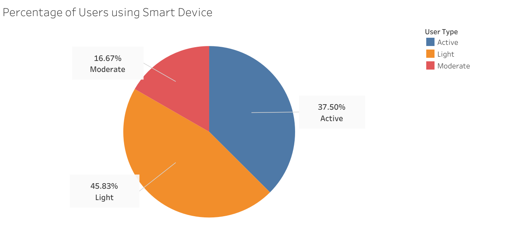

**2. Activity time of users**

Time spent by users on activities per day. 

```sql
--Average activity of users
SELECT Id,
  AVG(VeryActiveMinutes) AS avg_very_active_mins,
  AVG(FairlyActiveMinutes) AS avg_fairly_active_mins,
  AVG(LightlyActiveMinutes) AS avg_lightly_active_mins,
  AVG(SedentaryMinutes) AS avg_sedentary_mins
FROM `bellabeat.dailyActivity`
GROUP BY Id;
```
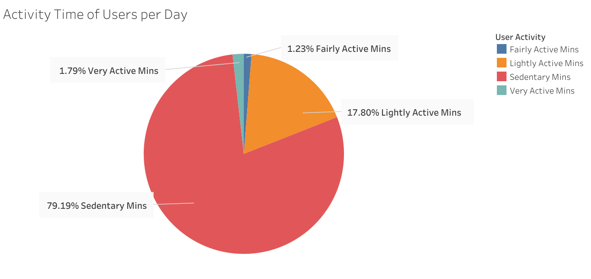

**3. The activity level of users based on total steps**

We categorize the activity level of users based on the total number of steps taken per day:

- Sedentary: Less than 5000 steps a day
- Lightly active: Between 5000 and 7499 steps a day
- Moderately active active: Between 7500 and 9999 steps a day
- Fairly active: Between 10000 and 12499 steps a day
- Highly active: >12500 steps a day

```sql
--Average steps of users
SELECT
  Id,
  AVG(TotalSteps) AS avg_total_steps,
  CASE
    WHEN AVG(TotalSteps) < 5000 THEN 'Sedentary'
    WHEN AVG(TotalSteps) BETWEEN 5000 AND 7499 THEN 'Lightly Active'
    WHEN AVG(TotalSteps) BETWEEN 7500 AND 9999 THEN 'Moderately Active'
    WHEN AVG(TotalSteps) BETWEEN 10000 AND 12499 THEN 'Fairly Active'
    WHEN AVG(TotalSteps) > 12500 THEN 'Highly Active'
  END AS activity_level
FROM `bellabeat.dailyActivity`
GROUP BY Id;
```
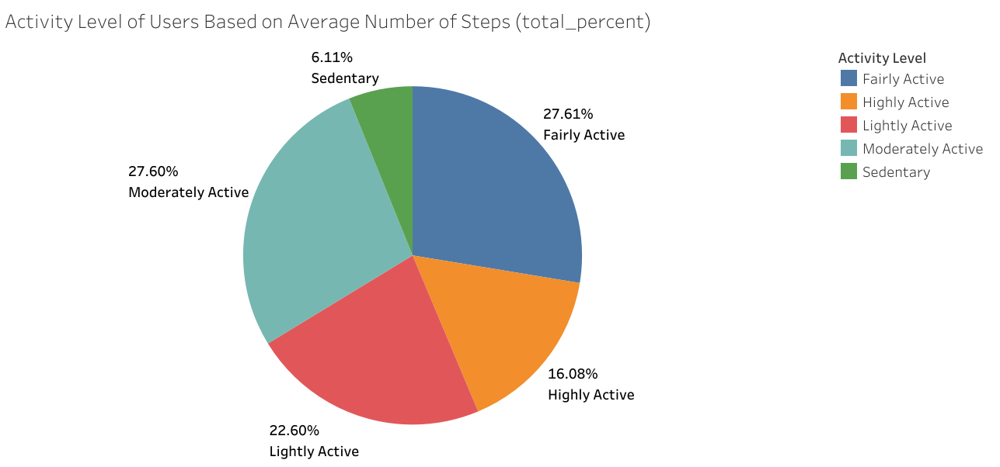

**4. Relation between activity time of users and calories burned**

```sql
WITH avg_activity AS (
  -- Average daily activity of users
  SELECT 
    Id,
    AVG(VeryActiveMinutes) AS avg_very_active_mins,
    AVG(FairlyActiveMinutes) AS avg_fairly_active_mins,
    AVG(LightlyActiveMinutes) AS avg_lightly_active_mins,
    AVG(SedentaryMinutes) AS avg_sedentary_mins
  FROM `bellabeat.dailyActivity`
  GROUP BY Id
),
avg_steps AS (
  -- Average daily steps of users
  SELECT
    Id,
    AVG(TotalSteps) AS avg_total_steps,
    CASE
      WHEN AVG(TotalSteps) < 5000 THEN 'Sedentary'
      WHEN AVG(TotalSteps) BETWEEN 5000 AND 7499 THEN 'Lightly Active'
      WHEN AVG(TotalSteps) BETWEEN 7500 AND 9999 THEN 'Moderately Active'
      WHEN AVG(TotalSteps) BETWEEN 10000 AND 12499 THEN 'Fairly Active'
      WHEN AVG(TotalSteps) > 12500 THEN 'Highly Active'
    END AS activity_level
  FROM `bellabeat.dailyActivity`
  GROUP BY Id
),
avg_calories AS(
  --Average caloried burned by users
  SELECT
    Id,
    AVG(Calories) AS avg_calories_burned
  FROM bellabeat.dailyActivity
  GROUP BY Id
)
-- Join the four CTEs based on Id
SELECT 
  a.Id,
  a.avg_very_active_mins,
  a.avg_fairly_active_mins,
  a.avg_lightly_active_mins,
  a.avg_sedentary_mins,
  s.avg_total_steps,
  s.activity_level,
  c.avg_calories_burned
FROM avg_activity a
JOIN avg_steps s ON a.Id = s.Id
JOIN avg_calories c ON a.Id = c.Id;
```
| 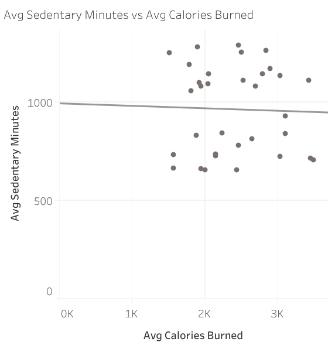 | 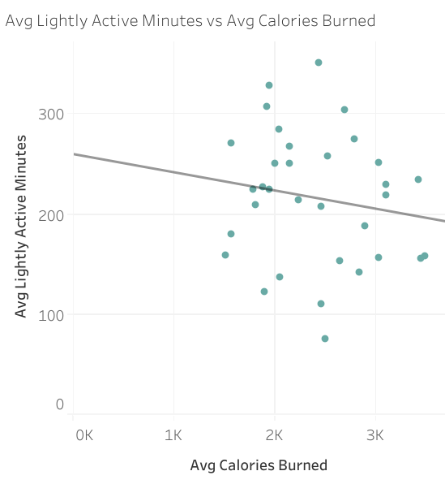 | 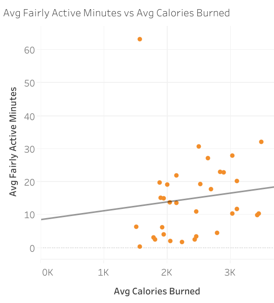 | 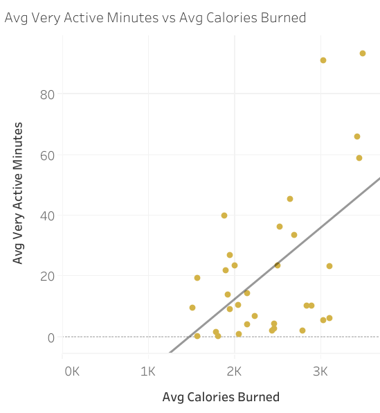 |
| :-----------------------------------------: | :-----------------------------------------: |  :-----------------------------------------: | :-----------------------------------------: |

- The R-squared value for sedentary minutes is 0.0010352
- The R-squared value for lightly active minutes is 0.0252009
- The R-squared value for fairly active minutes is 0.0148527
- The R-squared value for very active minutes is 0.297635

There is a moderate to strong positive correlation between very active minutes and calories burned indicated by the the R-squared value. Individuals who spend more minutes being very active tend to burn more calories on average. 

**5. Relation between average steps of users and calories burned**

| 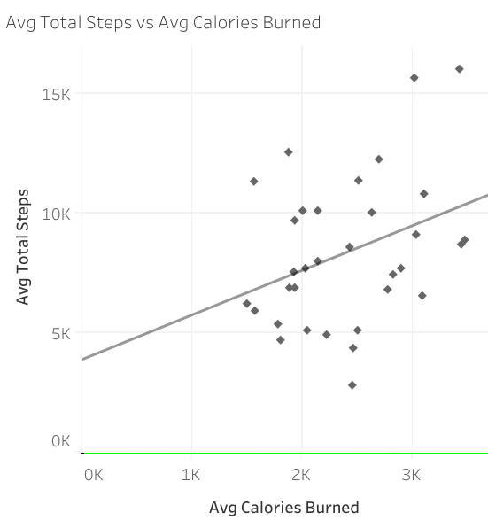 | 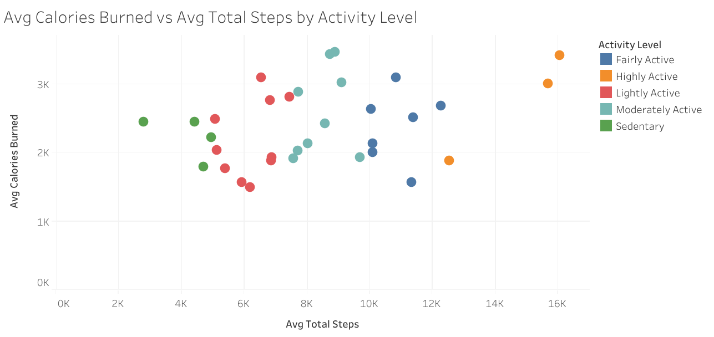 | 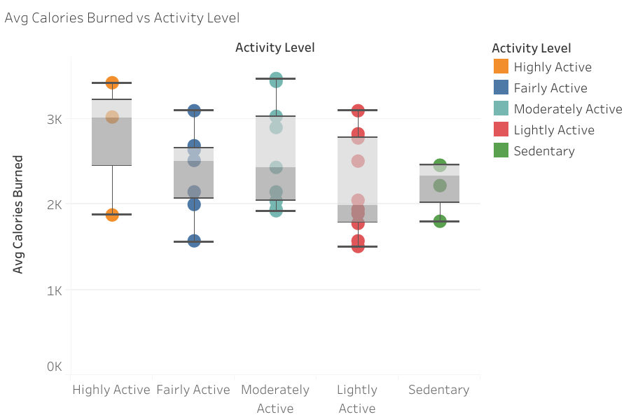
| :-----------------------------------------: | :-----------------------------------------: | :-----------------------------------------: |

The R-squared value is 0.119697. There is a moderate correlation between average steps taken by users and calories burned. Steps taken contribute to calories burned, but they are not the only factor. Other variables also play a significant role in determining the calories burned.

**6. Relation between sleeping hours and calories burned**

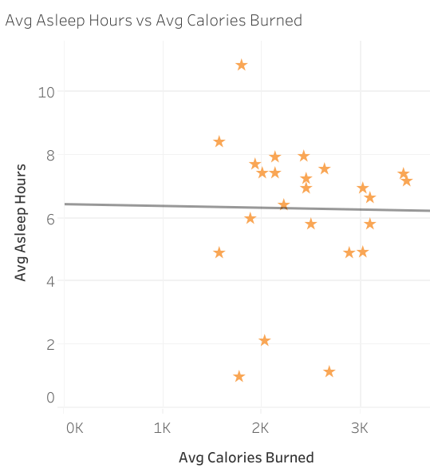

The R-squared value is 0.0001998. There is almost no linear relationship between average sleep hours and calories burned. This result may stem from insufficient data collected to track the user's sleep patterns, suggesting a potential area for improvement in future data collection.


  


